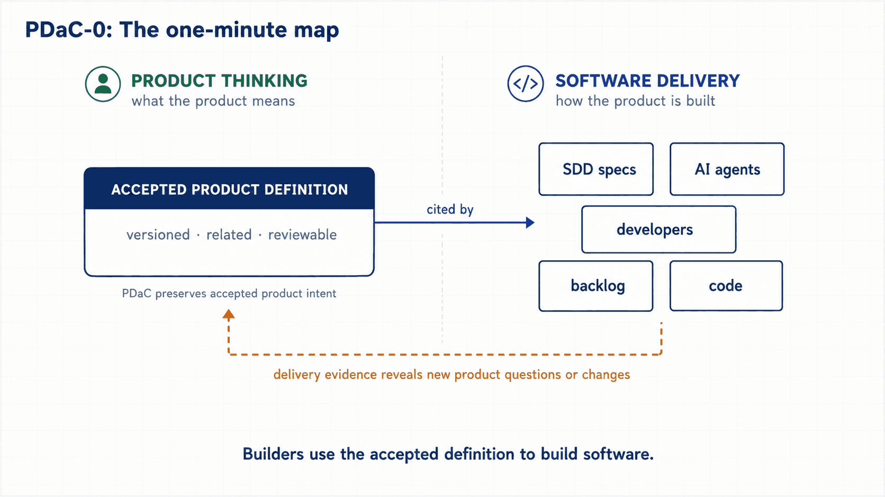

  

# The PDaC Specification

**The normative specification of Product Definition as Code (PDaC).**

PDaC is an open methodology for the upstream layer of the AI-SDLC. It models product knowledge as a versioned, validated graph of small, related Markdown artifacts: actors, journeys, use cases, business rules, domain language and requirements. Humans and AI agents consume the same canonical model, and every implementation increment traces back to the product knowledge it serves.

The boundary of the methodology is delivery itself, not one delivery discipline: the citation contract binds consumers to canonical product knowledge, and the same citations brief a Spec-Driven Development framework, an AI coding agent, or a human team working from the backlog.

This repository holds the specification, the manifesto and the conformance tests. It is implementation-independent by design: the spec defines contracts, not commands.

  

<em>PDaC-0 - what is PDaC, in one minute? <a href="https://pdac.dev/diagrams/">All nine diagrams</a>.</em>

## Status

**v0.1 (request for comments), extraction in progress.** Two weeks old and labeled accordingly: this is an early draft, not a near-final standard. The honest picture of every surface, the version dimensions and the gates to v1 are in [MATURITY.md](MATURITY.md); what the methodology cannot claim yet is in [known limits](https://pdac.dev/known-limits/).

The specification text is being extracted from the [reference implementation](https://github.com/juangcarmona/productshape), where it was developed and validated against a self-hosted product model. During extraction, chapters may still contain references to repository layouts or behaviors of the reference implementation; each of those references is being generalized or removed. v1.0 freezes after a public comment period.

| Milestone | State |
| --- | --- |
| Chapters extracted | In progress |
| Conformance tests (complete, normative set) | In progress; the published cases run today via [pdac-lint](https://www.npmjs.com/package/pdac-lint) |
| Public comment period (v0.1) | Planned |
| v1.0 freeze | Planned |

## Contents

The specification lives in [`spec/`](spec/index.md), in nine chapters: terminology, artifacts, frontmatter reference, identifiers, relationships, product changes, the citation contract, validation, and conformance. The key words MUST, MUST NOT, SHOULD, SHOULD NOT and MAY are interpreted as described in [RFC 2119](https://www.rfc-editor.org/rfc/rfc2119).

The founding position is [the manifesto](MANIFESTO.md). You can [sign it](SIGNATORIES.md).

## Implementations

| Implementation | Language | Status |
| --- | --- | --- |
| [ProductShape](https://github.com/juangcarmona/productshape) | TypeScript | Reference implementation, v0.x, self-hosted |

The specification wants more than one implementation. If you are building one, open an issue; the [conformance chapter](spec/conformance.md) and the published conformance tests define what "conformant" means (they are not yet a complete normative set). See [IMPLEMENTATIONS.md](IMPLEMENTATIONS.md) for listing criteria.

## Contributing

Changes to the specification go through the [RFC process](CONTRIBUTING.md). Governance, maintainers and decision rules are in [GOVERNANCE.md](GOVERNANCE.md). Adopters can add themselves to [ADOPTERS.md](ADOPTERS.md).

## License

The specification text and the manifesto are licensed under [CC BY 4.0](LICENSE.md). Code samples and conformance fixtures are licensed under Apache 2.0.
